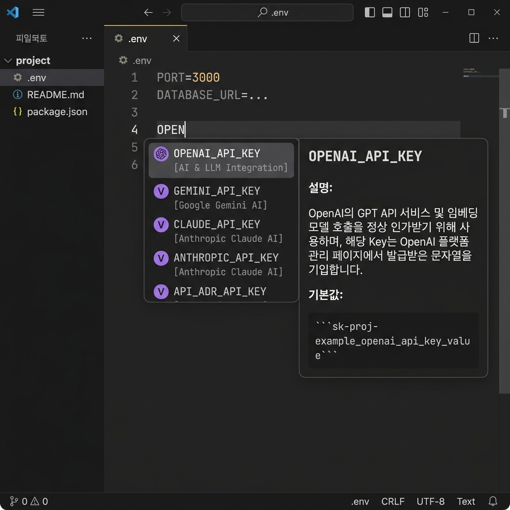
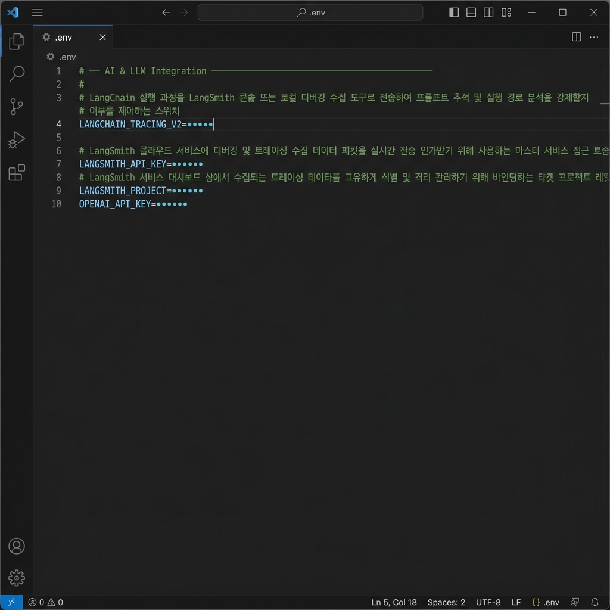
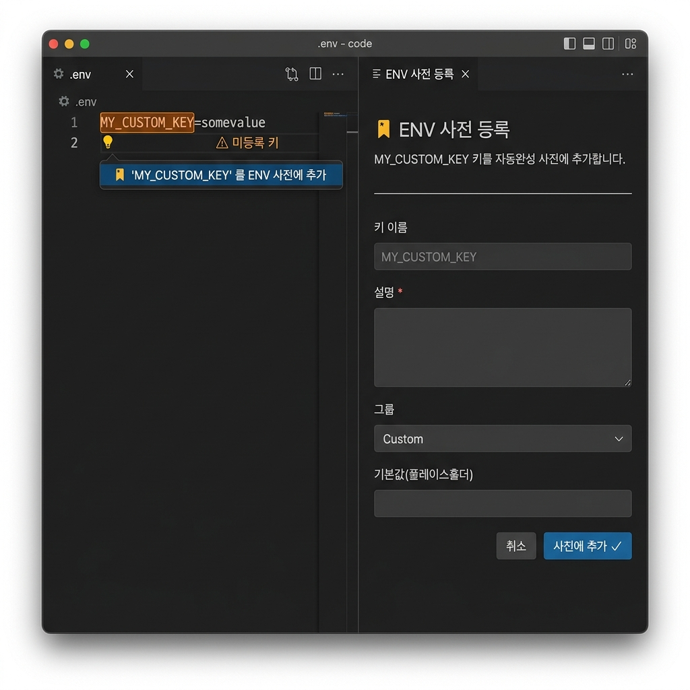

<div align="center">


# 🔐 ENV Autocomplete

**A VS Code extension that supercharges `.env` file editing with smart autocomplete, value masking, unknown key highlighting, and group-sorted formatting.**

[](https://github.com/hunchulchoi/env-autocomplete)
[](./LICENSE)
[](https://code.visualstudio.com/)

</div>

---

## ✨ Features

### 1. 🚀 Smart Autocomplete

Type any key in a `.env*` file and get instant IntelliSense suggestions from a built-in dictionary of **39 common environment variables**.

- Each suggestion shows its **group**, **description**, and **default value** in a detail popup.
- Selecting a key inserts a full snippet with a descriptive comment and a tab-stop placeholder:

```env
# [AI & LLM Integration] Secret API credential key for authorizing calls to OpenAI's GPT and embedding model APIs.
OPENAI_API_KEY=sk-proj-example_openai_api_key_value
```



---

### 2. 🔒 Value Masking

Sensitive values are automatically masked with `•••••` when you open a `.env` file — no accidental shoulder surfing.

| Action | Result |
|--------|--------|
| Open `.env` file | All values masked as `•••••` |
| Click a line | Mask removed — edit freely |
| Move to another line | Mask restored automatically |
| Hover over a masked value | Shows `🔒 Value is masked.` tooltip |



Disable masking any time:
```json
"envAutocomplete.maskValues": false
```

---

### 3. ⚠️ Unknown Key Highlight & Quick Fix

Any key **not found in the dictionary** is highlighted with an orange border and a `⚠ Unknown key` tag. A diagnostic warning appears in the Problems panel.

Press `Ctrl+.` / `Cmd+.` (or click the 💡 lightbulb) to open the **"Add to Dictionary"** form panel — all fields in one place:

| Field | Description |
|-------|-------------|
| Key name | Pre-filled, read-only |
| Description *(required)* | Shown in the autocomplete popup |
| Group | Dropdown with 10 built-in categories |
| Default value | Placeholder inserted on autocomplete |

After saving, the highlight disappears instantly and the key appears in autocomplete.



---

### 4. 📋 Format Document — Group Sorting

Run **Format Document** (`Shift+Alt+F`) to automatically sort all keys by group and add section header comments.

**Before:**
```env
OPENAI_API_KEY=sk-...
PORT=3000
DATABASE_URL=postgresql://...
MY_CUSTOM_KEY=abc
NODE_ENV=development
```

**After:**
```env
# ── Application Environment ────────────────────────────────────────
#
# Specifies the runtime environment (development, production, test) that controls compiler warnings and code optimization.
NODE_ENV=development
# The port number the web server binds to for handling incoming network traffic.
PORT=3000

# ── Database & Cache ────────────────────────────────────────────────
#
# Full connection string for the primary relational database, including engine, credentials, host, and database name.
DATABASE_URL=postgresql://...

# ── AI & LLM Integration ───────────────────────────────────────────
#
# Secret API credential key for authorizing calls to OpenAI's GPT and embedding model APIs.
OPENAI_API_KEY=sk-...

# ── Others ────────────────────────────────────────────────────────────
#
MY_CUSTOM_KEY=abc
```

> **Note:** If a key already has a hand-written comment above it, the formatter preserves it and does **not** add a duplicate description comment.

---

## 🗂 Built-in Dictionary Groups

| Group | Example Keys |
|-------|-------------|
| Application Environment | `NODE_ENV`, `PORT`, `DEBUG`, `LOG_LEVEL`, `APP_VERSION` |
| Database & Cache | `DATABASE_URL`, `REDIS_URL`, `REDIS_PASSWORD`, `CACHE_TTL`, `MEMCACHED_URL` |
| Security & Authentication | `SECRET_KEY`, `JWT_SECRET`, `GOOGLE_CLIENT_ID`, `GOOGLE_CLIENT_SECRET` |
| Cloud Provider API | `AWS_ACCESS_KEY_ID`, `GOOGLE_API_KEY`, `AZURE_CLIENT_ID`, `FIREBASE_TOKEN` |
| AI & LLM Integration | `OPENAI_API_KEY`, `GEMINI_API_KEY`, `ANTHROPIC_API_KEY`, `LANGSMITH_*` |
| Third-Party Integration | `STRIPE_API_KEY`, `TWILIO_ACCOUNT_SID`, `TWILIO_AUTH_TOKEN` |
| CI/CD & Hosting Platforms | `GITHUB_TOKEN` |
| Framework & Build Configuration | `NEXT_PUBLIC_API_URL`, `NEXT_PUBLIC_ANALYTICS_ID` |

---

## ⚙️ Settings

Configure the extension in your `settings.json`:

| Setting | Type | Default | Description |
|---------|------|---------|-------------|
| `envAutocomplete.enableBuiltInKeys` | `boolean` | `true` | Enable the built-in 39-key dictionary |
| `envAutocomplete.customKeys` | `object` | `{}` | Register your own custom env keys |
| `envAutocomplete.scanProjectForKeys` | `boolean` | `true` | Auto-detect `process.env.KEY` usages in source files |
| `envAutocomplete.maskValues` | `boolean` | `true` | Mask values as `•••••` in `.env` files |
| `envAutocomplete.highlightUnknownKeys` | `boolean` | `true` | Highlight keys not found in the dictionary |

### Custom Key Example

```json
"envAutocomplete.customKeys": {
  "MY_SERVICE_URL": {
    "value": "https://api.myservice.com",
    "description": "Internal microservice API gateway endpoint.",
    "group": "Custom"
  }
}
```

---

## 📄 Supported File Patterns

| File | Supported |
|------|-----------|
| `.env` | ✅ |
| `.env.example` | ✅ |
| `.env.local` | ✅ |
| `.env.development` | ✅ |
| `.env.production` | ✅ |
| `.env.test` | ✅ |

---

## 🛠 Development

```bash
# Install dependencies
npm install

# Compile TypeScript
npm run compile

# Run unit tests
npm test

# Package as .vsix
npm run package
```

### Local Debugging

1. Open the project in VS Code.
2. Press `F5` to launch the **Extension Development Host**.
3. Open any `.env` file in the new window to test all features.

---

## 📁 Project Structure

```
src/
├── extension.ts      # VS Code entry point — wires all features together
├── dictionary.ts     # Built-in dictionary of 39 environment variable keys
├── completion.ts     # Autocomplete logic (merge & snippet builder)
├── scanner.ts        # Static analyzer for process.env.KEY in source files
├── formatter.ts      # Format Document — group sorting & section headers
└── addKeyPanel.ts    # WebView panel form for adding unknown keys

tests/
├── completion.test.ts
└── scanner.test.ts
```

---

## 📄 License

[MIT](./LICENSE) © 2024 myside
